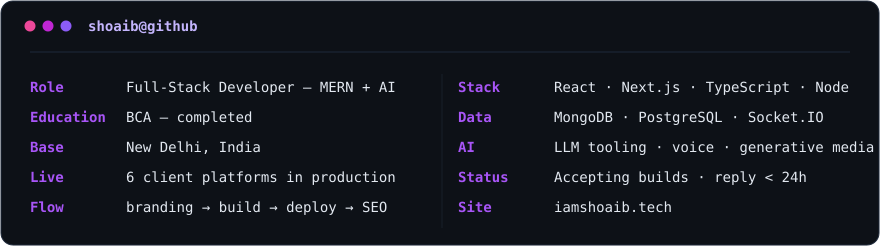

<!-- ════════════════════════════════════════════════════════════════════
     shoaibhasann / README.md  ·  animated, self-hosted SVG art
     Palette: #0f172a → #6366f1 → #a855f7 → #ec4899   (no green, by design)
════════════════════════════════════════════════════════════════════ -->

  

  

&nbsp;

&nbsp;

  

<h3><code>shoaib@github ~ $ whoami</code></h3>

<table>
  <tr>
    <td valign="top"></td>
    <td valign="top"></td>
  </tr>
</table>

 

<i>Not demos — deployments. Real businesses, real traffic, in production today.</i>

| # | Project | Shipped | Focus |
|:-:|:--------|:--------|:------|
| `00` | **AJ Consultancy** | MBBS admissions portal for NMC-approved universities in Russia — counselling, visa, placements | `Next.js` `SEO` `Branding` |
| `01` | **Majestique Global** | B2B export platform for a 25-yr leather-goods manufacturer in Agra, shipping to 40+ global markets | `Web Dev` |
| `02` | **City Physio** | Conversion-focused clinic site — services, doctor profiles, appointment booking | `Web Dev` |
| `03` | **Rise Chemical** | SEO lead-gen site for an ISO-certified industrial water-treatment chemical manufacturer | `SEO` `Growth` |
| `04` | **Brew Room** | Café website for Chennai — menu, gallery, loyalty & online table reservation | `Web` `Branding` |
| `05` | **RMV International** | Immigration & manpower consultancy in Madurai — work permits across 25+ countries | `Web` `SEO` |

 

**Frontend / Mobile**

**Backend / Realtime / Database**

**Tools / DevOps / CI-CD**

**Motion / AI / Media**

 

<i>Where I pressure-test ideas before they reach client work.</i>

| Repo | Build | Stack |
|:-----|:------|:------|
| [**threads-clone**](https://github.com/shoaibhasann/threads-clone) | Threads rebuilt from zero — follow, post, comment, like, repost | `MERN` `Tailwind` |
| [**Jarvis-AI**](https://github.com/shoaibhasann/Jarvis-AI) | Voice assistant powered by Gemini — full voice interaction | `JS` `Gemini` |
| [**Coursify-LMS**](https://github.com/shoaibhasann/Coursify-LMS) | Full-stack learning management system | `Node` `Express` `Mongo` `React` |
| [**ImaginAI-Gallery**](https://github.com/shoaibhasann/ImaginAI-Gallery) | AI image generation saved to Cloudinary | `MERN` `Cloudinary` |
| [**COINPULSE-Crypto-Data**](https://github.com/shoaibhasann/COINPULSE-Crypto-Data) | Real-time crypto market data & trends | `React` `REST API` |
| [**chat-app**](https://github.com/shoaibhasann/chat-app) | Real-time messaging over WebSockets | `Node` `Express` `Socket.IO` |

 

Have a product that needs to exist? The fastest way to find out if we're a fit is a short message — I reply within 24 hours.

&nbsp;

&nbsp;

  

<b>Shipped. Scaled. Zero shortcuts.</b>

